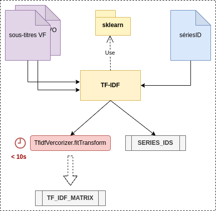
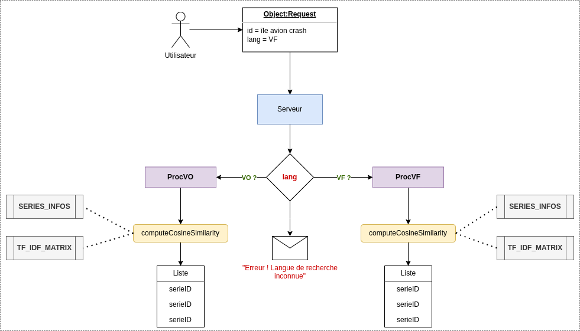

# SerieNet API


## Sommaire

- [Description](#description)
- [Installation](#installation)
  - [Prérequis](#prérequis)
  - [Installation (Linux)](#installation)
  - [Utilisation](#utilisation)
- [Auteurs](#auteurs)
- [Crédits](#crédits)

## Description

SerieNet API est un serveur FLASK permettant de réaliser des recherches de séries TV des années 90 via
leurs sous-titres. Il utilise l'algorithme de recherche de similarité de textes TF-IDF.

* Initialisation :



Lors de l'initialisation, l'API va créer 2 Objets `TF-IDF` (un pour les sous-titres en français et un pour les sous-titres en anglais) 
qui vont permettre de calculer la similarité entre les sous-titres et la requête de l'utilisateur.
Chaque objet `TF-IDF` va être initialisé et va stocker une matrice TF-IDF pour chaque série TV.

> `TF-IDF` est la clase conçu qui utilise la librairie [scikit-learn](https://scikit-learn.org/stable/) pour créer une matrice TF-IDF avec la méthode 
> [TfidfVectorizer](https://scikit-learn.org/stable/modules/generated/sklearn.feature_extraction.text.TfidfVectorizer.html) et calculer la similarité 
> entre 2 textes avec la méthode [cosine_similarity](https://scikit-learn.org/stable/modules/generated/sklearn.metrics.pairwise.cosine_similarity.html). (Merci à Julien Breton pour la découverte de cette technique :) )

* Recherche :



Lors d'une recherche, l'API va récupérer la requête de l'utilisateur et va la traiter. Elle va ensuite calculer la similarité entre la requête et chaque série TV. 
Les séries TV ayant une similarité supérieure à 0.1 seront retournées à l'utilisateur avec une limite de 5 séries TV triées par ordre décroissant de similarité.

## Installation

* *Le projet a été développé sous Linux, il est donc **recommandé** d'utiliser un **environnement Linux** pour l'installation.*
* *Si vous possédez la VM serieNet.ova, vous pouvez directement lire le README.md présent sur le bureau de la VM.*

### Prérequis

- `Python 3.8 ou supérieur`
- `pip`
- `virtualenv`
- `git`

### Installation

1. Cloner le projet

```bash
git clone https://github.com/Maxiwere45/seriesNet
```

2. Créer un environnement virtuel dans le dossier du projet

```bash
python3 -m venv .venv
```

* En cas de difficulté, se référer à la documentation officielle de [Python](https://packaging.python.org/en/latest/guides/installing-using-pip-and-virtual-environments/)

3. Activer l'environnement virtuel

```bash
source .venv/bin/activate
```

4. Installer les dépendances avec la commande 

```bash
pip install -r data/requirements.txt
```

5. Télécharger les données nécessaires au fonctionnement de l'API depuis le lien suivant : `en cours de création`

6. Décompresser l'archive dans le dossier `data`

* Le dossier `data` doit contenir les fichiers suivants :
  * `data/data_vf.json`
  * `data/data_vo.json`
  * `data/seriesInfos.json`

## Utilisation

* Exécuter la commande suivante depuis le dossier racine du projet pour lancer le serveur :

```bash
gunicorn -w 1 -b 0.0.0.0:5000 app:app
```

## Auteurs

* **Anrifou Amdjad** _alias_ [@Maxiwere45](https://github.com/Maxiwere45)
* **PREMI CARL** _alias_ [@otsubyo](https://github.com/otsubyo)

* Professeurs encadrants :
  * **M. BROISIN JULIEN** _alias_ [@bretonJulien](https://www.linkedin.com/in/jln-brtn/)
  * **M. BRETON JULIEN** _alias_ [@broisinJulien](https://www.linkedin.com/in/jbroisin/)

## Crédits

Ce projet a été réalisé dans le cadre d'un projet scolaire à l'[IUT PAUL SABATIER de Toulouse](https://iut.univ-tlse3.fr/) pour l'année 2023-2024 dans le
parcour [Administration, gestion et exploitation des bases de données](https://iut.univ-tlse3.fr/but-informatique-parcours-administration-gestion-et-exploitation-des-donnees-toulouse) (AGED).
